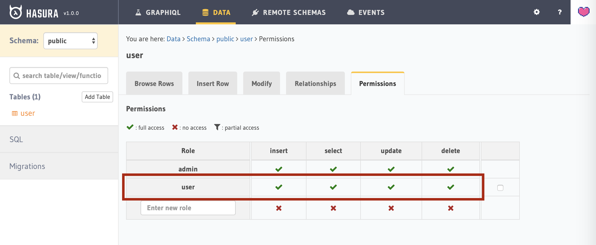

# hasura-cookie-auth-example

## Prerequisites

* [Docker](https://docs.docker.com/install/)
* [Docker Compose](https://docs.docker.com/compose/install/)
* [Node.js](https://nodejs.org/)
* [Yarn](https://yarnpkg.com/lang/)

## Setup

```shell
$ git clone https://github.com/devilune/hasura-cookie-auth-example.git
$ cd hasura-cookie-auth-example
$ docker-compose -p hasura up -d # After completing this command, it takes about 2 minutes to insert the seed data
$ yarn
```

## Run

```shell
$ yarn dev
```

Go to http://app.hasura-example.localhost/

## Open Hasura console

```shell
$ npx hasura console --admin-secret=myadminsecretkey
```

## Stop containers

```shell
$ docker-compose -p hasura down
```

## How

*app.js*

```js
app.get("/auth", (req, res) => {
  if (req.session.user) {
    const hasuraVariables = {
      "X-Hasura-Role": "user"
    };
    res.json(hasuraVariables);
  } else {
    res.sendStatus(401);
  }
});
```



*views/index.ejs*

```js
const res = await fetch(
  "http://gql.hasura-example.localhost/v1/graphql",
  {
    method: "POST",
    headers: {
      "Content-Type": "application/json"
    },
    credentials: "include",
    body: JSON.stringify({ query })
  }
);
```

*docker-compose.yaml*

```yaml
environment:
  ...
  HASURA_GRAPHQL_ADMIN_SECRET: myadminsecretkey
  HASURA_GRAPHQL_AUTH_HOOK: http://host.docker.internal:3000/auth
```
